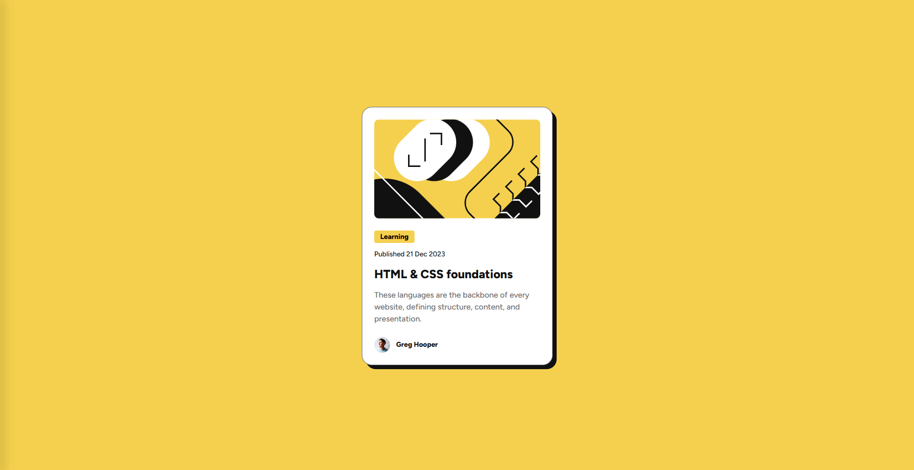

# Blog Preview Card


> This is a solution to the "Blog preview card" challenge on [Frontend Mentor](https://www.frontendmentor.io/). The goal was to build a component that is visually as close as possible to the proposed design, practicing fundamental HTML and CSS skills.

<br>

**🚀 [View Live Demo](https://blog-preview-card-two-iota.vercel.app/)**

<br>

### 🖥️ Screenshot



---

### 📋 Table of Contents

* [The Challenge](#-the-challenge)
* [Tech Stack](#-tech-stack)
* [What I Learned](#-what-i-learned)
* [How to View](#-how-to-view)
* [Author](#-author)

---

### 🚀 The Challenge

The challenge was to build a blog preview card component and get it looking as close to the design as possible. This involved:
* Structuring the content with semantic HTML, including the `<time>` tag for the date.
* Recreating the layout with specific attention to the card's `box-shadow` and custom font.
* Implementing a hover state for the main title to improve interactivity.

---

### 🛠️ Tech Stack

The following tools and technologies were used in the construction of this project:

* **HTML5:** For structure and content semantics.
* **CSS3:** For styling, layout, and design.
    * **Local Fonts (`@font-face`):** For greater control over typography by loading font files directly.
    * **Fluid Typography (`clamp()`):** To create responsive font sizes that scale smoothly with the viewport.
    * **CSS Custom Properties (Variables):** To keep a cleaner and more reusable code for colors and spacing.
    * **Flexbox & Grid:** To build the component's layout and center it on the page.

---

### 📖 What I Learned

This project was a fantastic opportunity to practice more advanced and modern CSS techniques, building upon my foundational skills.

* **Fluid Typography with `clamp()`:** I learned how to use the `clamp()` CSS function to make font sizes fluid. This allows the text to scale smoothly between a minimum and maximum size based on the viewport width, which is a powerful technique for responsive design.

* **Local Font Loading with `@font-face`:** Instead of relying on external font services, I practiced loading local font files using `@font-face`. This gave me a better understanding of how to manage project assets and optimize font performance.

* **Modern Responsive Units (`min()`):** I used `width: min(100%, 38.4rem)` on the card. This is a modern and concise way to ensure an element is responsive: it will take up 100% of its container's width until it hits a maximum value, preventing it from becoming too large on wider screens.

* **Semantic HTML (`<time>`):** I used the `<time>` tag with a `datetime` attribute to represent the publication date. This improves the semantics and accessibility of the page, providing machine-readable date information.

* **Interactive Hover Effects:** I implemented a `:hover` state on the card's title, changing its color. This simple addition makes the interface feel more interactive and responsive to user actions.

---

### 📂 How to View

You can view the final result online or, if you prefer, clone the repository to explore the code on your machine.

**Option 1: Live Demo (Recommended)**

The easiest way to see the project in action is by accessing the deploy link:

👉 **[Access the live demo](https://blog-preview-card-two-iota.vercel.app/)**

---

**Option 2: Running Locally**

If you want to explore the source code, follow these steps:

```bash
# 1. Clone this repository (change 'your-user' and 'repository-name')
git clone [https://github.com/WhatsIgorDoing/blog-preview-card.git](https://github.com/WhatsIgorDoing/blog-preview-card.git)

# 2. Navigate to the project folder
cd repository-name

# 3. Open the index.html file in your browser
```

---

### 👨‍💻 Author

Project developed by **Igor Bueno**.

[](https://www.linkedin.com/in/engigorbueno/)
[](https://github.com/WhatsIgorDoing)